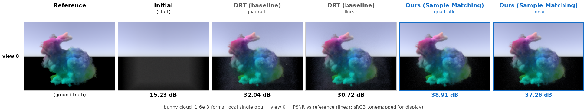

<br />
<p align="center">
  <h1 align="center">Sample Matching for Joint Extinction Gradient Estimation<br/>in Differentiable Volume Rendering</h1>
</p>

<p align="center">
  ACM Transactions on Graphics (Proceedings of SIGGRAPH 2026)
  <br />
  <a href="https://auroraryan0301.github.io/samplematching/"><strong>Ruihan Yu</strong></a>
  ·
  <a href="https://bulbaberry.xyz/about/"><strong>Yu-Chen Wang</strong></a>
  ·
  <a href="https://gerwang.github.io/"><strong>Jingwang Ling</strong></a>
  ·
  <a href="http://xufeng.site/"><strong>Feng Xu</strong></a>
  ·
  <a href="https://shuangz.com/"><strong>Shuang Zhao</strong></a>
</p>

<p align="center">
  <a href="https://auroraryan0301.github.io/samplematching/">
    </a>
  <a href="https://auroraryan0301.github.io/samplematching/static/papers/sample_matching_paper.pdf">
    </a>
  <a href="https://doi.org/10.1145/3811329">
    </a>
  <a href="https://huggingface.co/datasets/AuroraRyan/sample-matching-data">
    </a>
</p>

<p align="center">
  
</p>

<br>

Overview
--------

This repository contains the reference implementation of:

> Ruihan Yu, Yu-Chen Wang, Jingwang Ling, Feng Xu, and Shuang Zhao. 2026.
> **Sample Matching for Joint Extinction Gradient Estimation in Differentiable
> Volume Rendering.** ACM Trans. Graph. 45, 4, Article 136 (July 2026),
> 15 pages. https://doi.org/10.1145/3811329

Differentiating the volumetric path integral with respect to the extinction
coefficient splits the gradient into a **scattering** term (evaluated at a path
vertex) and a **transmittance** term (integrated along the ray segment). These
two terms have opposite signs and are therefore negatively correlated, but
existing estimators sample them at *different* locations and leave that
correlation unexploited. **Sample matching** evaluates both components at
**shared sample locations**, activating the negative covariance and reducing
extinction-gradient variance by up to 80% over differential ratio tracking
(DRT), without introducing bias.

The implementation builds on the [Mitsuba 3](https://github.com/mitsuba-renderer/mitsuba3)
differentiable renderer and uses **differential ratio tracking** (Nimier-David
et al. 2022) as the baseline.


Citation
--------

```bibtex
@article{yu2026samplematching,
    author    = {Yu, Ruihan and Wang, Yu-Chen and Ling, Jingwang and Xu, Feng and Zhao, Shuang},
    title     = {Sample Matching for Joint Extinction Gradient Estimation in Differentiable Volume Rendering},
    journal   = {ACM Transactions on Graphics},
    year      = {2026},
    month     = jul,
    volume    = {45},
    number    = {4},
    articleno = {136},
    numpages  = {15},
    doi       = {10.1145/3811329},
    url       = {https://doi.org/10.1145/3811329},
    publisher = {Association for Computing Machinery},
    address   = {New York, NY, USA},
}
```

This work builds on the DRT baseline; if you use this code, please also cite:

```bibtex
@article{nimierdavid2022unbiased,
    author    = {Merlin Nimier-David and Thomas M\"uller and Alexander Keller and Wenzel Jakob},
    title     = {Unbiased Inverse Volume Rendering with Differential Trackers},
    journal   = {ACM Trans. Graph.},
    issue_date = {July 2022},
    volume    = {41},
    number    = {4},
    month     = jul,
    year      = {2022},
    pages     = {44:1--44:20},
    articleno = {44},
    numpages  = {20},
    url       = {https://doi.org/10.1145/3528223.3530073},
    doi       = {10.1145/3528223.3530073},
    publisher = {ACM},
    address   = {New York, NY, USA},
    keywords  = {differentiable rendering, inverse rendering, volumetric rendering, radiative backpropagation, importance sampling}
}
```


Getting started
---------------

### 1. Build Mitsuba 3

This code relies on modifications to Mitsuba 3 that live on the
`unbiased-inverse-volume-rendering` branch (the same branch used by the DRT
baseline). **Make sure to check out that branch**:

```bash
git clone --recursive https://github.com/mitsuba-renderer/mitsuba3 --branch unbiased-inverse-volume-rendering
cd mitsuba3
mkdir build && cd build
cmake -GNinja ..
ninja
```

Please use the `cuda_ad_rgb` variant. See the
[Mitsuba 3 docs](https://mitsuba.readthedocs.io/) for full build instructions.

<details>
<summary><b>Building on a recent toolchain</b> (GCC &ge; 13 / CMake &ge; 4) — click to expand</summary>

This is a 2022-era branch (Mitsuba 3.0.0 /
Dr.Jit 0.2.1) and compiles cleanly with a period-appropriate compiler. On a
current Linux system (e.g. GCC >= 13, CMake >= 4) the plain `cmake .. && ninja`
above fails. The following recipe was verified on GCC 16 / CMake 4;
it installs a 2022-era compiler into a conda env and points CMake at it:

```bash
conda create -n samplematching python=3.10 -y
conda install -n samplematching -c conda-forge gcc_linux-64=12 gxx_linux-64=12 zlib -y
CONDA=$(conda info --base)/envs/samplematching
export CMAKE_POLICY_VERSION_MINIMUM=3.5            # bundled submodules predate CMake 3.5
export CPATH=$CONDA/include LIBRARY_PATH=$CONDA/lib
cmake -GNinja \
    -DCMAKE_C_COMPILER=$CONDA/bin/x86_64-conda-linux-gnu-gcc \
    -DCMAKE_CXX_COMPILER=$CONDA/bin/x86_64-conda-linux-gnu-g++ \
    -DPython_EXECUTABLE=$CONDA/bin/python \
    -DCMAKE_POLICY_VERSION_MINIMUM=3.5 \
    -DCMAKE_CXX_FLAGS="-include cstdint -include limits -include algorithm -include cstring" \
    -DCMAKE_EXE_LINKER_FLAGS="-L$CONDA/lib -Wl,-rpath-link,$CONDA/lib -Wl,-rpath,$CONDA/lib" \
    -DCMAKE_SHARED_LINKER_FLAGS="-L$CONDA/lib -Wl,-rpath-link,$CONDA/lib -Wl,-rpath,$CONDA/lib" \
    -DCMAKE_MODULE_LINKER_FLAGS="-L$CONDA/lib -Wl,-rpath-link,$CONDA/lib -Wl,-rpath,$CONDA/lib" \
    ..
ninja
```

One source patch is also needed: in `ext/drjit/include/drjit/packet_intrin.h`,
define `_X86GPRINTRIN_H_INCLUDED` next to the existing `_IMMINTRIN_H_INCLUDED`
(GCC >= 11 moved the BMI intrinsics behind a new include guard). The `-include`
flags work around headers that newer libstdc++ no longer pulls in transitively
(e.g. `std::numeric_limits`); the linker flags resolve `libatomic` for the
`mitsuba` CLI. To build only what you need, set `"enabled"` to
`["scalar_rgb", "cuda_ad_rgb"]` in `build/mitsuba.conf` and re-run cmake.

`cuda_ad_rgb` runs unmodified on recent GPUs: Dr.Jit emits `sm_60` PTX that
the driver re-JITs for the installed device.

</details>

### 2. Clone this repository and install Python dependencies

```bash
git clone https://github.com/AuroraRyan0301/SampleMatching.git
cd SampleMatching
pip install -r requirements.txt
```

Make the Mitsuba 3 libraries available in your session before running anything:

```bash
source ../mitsuba3/build/setpath.sh
python3 -c "import mitsuba as mi; mi.set_variant('cuda_ad_rgb')"   # should run without output
```

### 3. Download the data

Scene files (XML configs, `.vol` grids, meshes, environment maps) and the
multi-view reference images are hosted on Hugging Face. Download and unpack them
into a top-level `data/` directory:

```bash
hf download AuroraRyan/sample-matching-data posttracking_data.tar.gz \
    --repo-type dataset --local-dir .
mkdir -p data && tar -xzf posttracking_data.tar.gz -C data
```

The expected layout (see `python/constants.py`) is:

```
data/
├── scenes/            scene XMLs + .vol grids + textures (one dir per scene, plus common/)
└── mi_ref/<scene>/    multi-view reference images (ref_XXXXXX.exr)
```

You can also point `POSTTRACKING_DATA_DIR` at any other location instead of
`data/`.


Running an optimization
-----------------------

All experiments are driven by `python/reproduce.py`. List the available
configurations:

```bash
python3 python/reproduce.py --list
```

Run one scene with all four methods, or a single method:

```bash
# all four standard methods on bunny-cloud
python3 python/reproduce.py --config bunny-cloud-l1-6e-3-formal-local-single-gpu

# a single method
python3 python/reproduce.py --config bunny-cloud-l1-6e-3-formal-local-single-gpu \
        --integrator volpathfm-drt-sd-n4
```

Outputs (checkpoints, preview renders, PSNR logs) are written to `output/`
(override with `POSTTRACKING_OUTPUT_DIR`). Pass `--log` to enable optional
Weights & Biases logging.

Once a run has finished, build a side-by-side comparison figure from its preview
renders. `datagen/make_fig.py` reads the preview `.exr` files from
`output/<config>/<method>/`, tonemaps them to sRGB, and lays out
`[reference | initial | each method's final render]` for one view, annotating each
cell with its PSNR against the reference:

```bash
python datagen/make_fig.py --config bunny-cloud-l1-6e-3-formal-local-single-gpu --view 0
```

The result on a held-out test view of `bunny-cloud` — Sample Matching ("ours")
reaches a higher PSNR than the DRT baseline in both the quadratic and linear cost
regimes:



### Methods

Each formal experiment compares the DRT baseline against our method, each in a
quadratic-cost and a linear-cost variant:

| Config (`--integrator`)            | Integrator plugin       | Method            | Cost      |
|------------------------------------|-------------------------|-------------------|-----------|
| `volpathsimple-drt-mis-n4`         | `volpathsimple`         | DRT (baseline)    | quadratic |
| `volpathsimple-drt-mis-linear`     | `volpathsimple`         | DRT (baseline)    | linear    |
| `volpathfm-drt-sd-n4`              | `volpathfm_sd`          | ours              | quadratic |
| `volpathfm-linear-drt-sd-n4`       | `volpathfm_linear_sd`   | ours              | linear    |

See `python/opt_config.py` for the full set of integrator variants and their
options.

### Scenes

`bunny-cloud`, `astronaut-rotated`, `jellyfish`, `teapot`, `scarf`, `rover`,
`dragon_media2`, `dust-devil`. Per-scene hyper-parameters (learning rate,
multi-resolution upsampling schedule, sensors) are defined in
`python/scene_config.py` and `python/reproduce.py`.


Repository structure
--------------------

```
python/
├── reproduce.py            experiment entry point (configs for the 8 paper scenes)
├── optimize.py             optimization loop: rendering, loss, Adam, upsampling, checkpoints, previews
├── scene_config.py         per-scene definitions (XMLs, init values, sensors, reference config)
├── opt_config.py           optimization & integrator configurations
├── batched.py              batched multi-sensor rendering (render_batch)
├── losses.py               loss functions (L1, L2, Huber, MRAE, ...)
├── util.py                 helpers (volume I/O, checkpoint saving, PSNR, tonemapping)
├── constants.py            data/output path configuration (env-overridable)
├── relighting_render.py            (optional) re-render reconstructions under a new envmap
├── calculate_relighting_psnr.py    (optional) HDR quality metrics (PSNR / SSIM / LPIPS)
└── integrators/
    ├── volpathsimple.py            baseline: differential ratio tracking (Nimier-David et al. 2022)
    ├── volpathfm_sd.py             ours: sample matching, quadratic O(n^2)
    ├── volpathfm_linear_sd.py      ours: sample matching, linear O(n)
    └── volpathsimple_no_bg.py      forward-only integrator for background-free previews
datagen/
├── gen_sensors.py / sensor_gen.py / gen_vol.py / render.py / upsampling.py   scene/sensor/volume generation
└── make_fig.py             build the README method-comparison figure from a run's previews
```


Notes
-----

This codebase builds on the 2022 "Unbiased Inverse Volume Rendering" code of
Nimier-David et al. and inherits its constraints: it is pinned to a specific,
older Mitsuba 3 branch, contains a number of bugs, and is not easy to maintain.
We provide it here so the paper's results can be reproduced as-is.

We plan to release a cleaner reimplementation targeting the **latest Mitsuba 3**
in the future.


Acknowledgements
----------------

This project builds directly on
[**Unbiased Inverse Volume Rendering with Differential Trackers**](https://github.com/rgl-epfl/unbiased-inverse-volume-rendering)
(Nimier-David, Müller, Keller, Jakob; SIGGRAPH 2022), whose code provides the
DRT baseline and the experiment framework, and uses the
[Mitsuba 3](https://www.mitsuba-renderer.org/) renderer.

The environment maps and fabric used in the teaser were provided by
[PolyHaven](https://polyhaven.com); the marble pillar in the teaser is from
[Sketchfab](https://sketchfab.com) by [Louqeekon](https://sketchfab.com/Louqeekon).


License
-------

Released under the [BSD 3-Clause License](LICENSE). If you use this code in
academic research, please cite the paper above.
</content>
